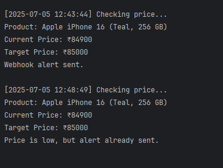
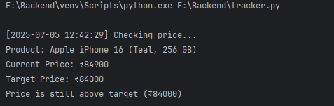

# 📦 Real-Time E-commerce Price Tracker with Webhook Alerts

A lightweight Python script that monitors the price of a product on Flipkart and alerts you when it drops below your target price.

---
## 🔍 Features

-  Scrapes **product title** and **current price** in real-time  
-  Sends **email alerts** and **webhook notifications**  
-  Checks the price **every 5 minutes** (configurable)  
-  Logs alerts to `alerts.csv` with timestamp and price history  

---

## 🔧 Tech Stack

- **Python 3**
- **Requests** – for HTTP requests  
- **BeautifulSoup (bs4)** – for HTML parsing  
- **SMTP (smtplib)** – for sending email notifications  
- **CSV** – for logging price alerts  
- **Webhooks** – for real-time alert integrations

### Result Images

